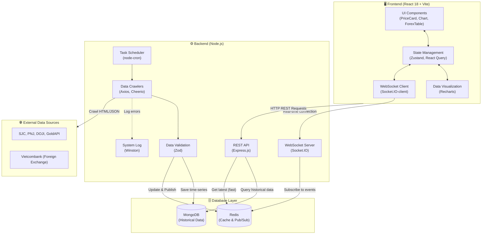
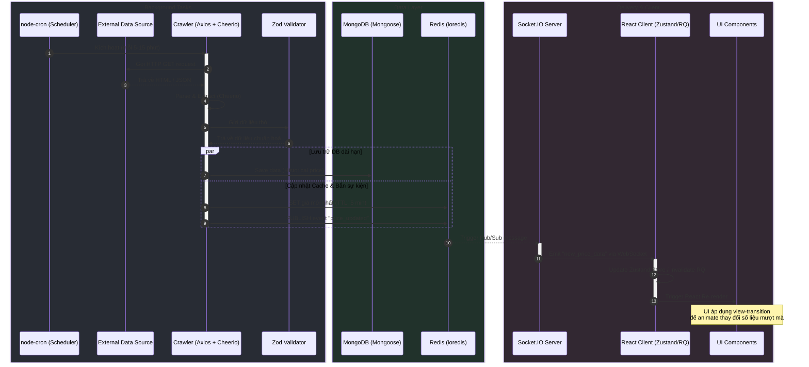

# 🏗️ System Architecture & Data Flow

Dưới đây là sơ đồ trực quan hóa kiến trúc hệ thống và luồng dữ liệu chi tiết dựa trên stack công nghệ đã cung cấp.

## 1. Tổng quan kiến trúc hệ thống (System Architecture)

Biểu đồ này thể hiện cấu trúc tổng thể của hệ thống, bao gồm các thành phần Frontend, Backend, Database và External Sources tương tác với nhau như thế nào.



## 2. Luồng dữ liệu chi tiết (Detailed Data Flow)

Sơ đồ tuần tự (Sequence Diagram) dưới đây mô tả chính xác luồng di chuyển của dữ liệu từ lúc crawler được kích hoạt cho đến khi người dùng nhìn thấy dữ liệu cập nhật trên giao diện.



## 📋 Tóm tắt cấu trúc thư mục (Tham khảo)

Mô hình kiến trúc trên trực tiếp tương ứng với cấu trúc thư mục của dự án:

```text
project/
├── client/                     ← Frontend (React/Vite)
│   └── src/
│       ├── components/         ← PriceCard, Chart, ForexTable (Visual Layer)
│       ├── hooks/              ← useGoldPrice, useForex (Logic Layer)
│       ├── store/              ← Zustand store (State Layer)
│       └── services/           ← socket.client.js, api.client.js
└── server/                     ← Backend (Node.js)
    └── src/
        ├── crawlers/           ← sjc.js, goldapi.js, vcb.js (Axios, Cheerio)
        ├── routes/             ← api/prices, api/forex (Express REST)
        ├── jobs/               ← cron.js (node-cron)
        ├── models/             ← Price.model.js (Mongoose/MongoDB)
        ├── utils/              ← validator.js (Zod), logger.js (Winston)
        └── socket/             ← socket.server.js (Socket.IO, Redis Pub/Sub)
```
